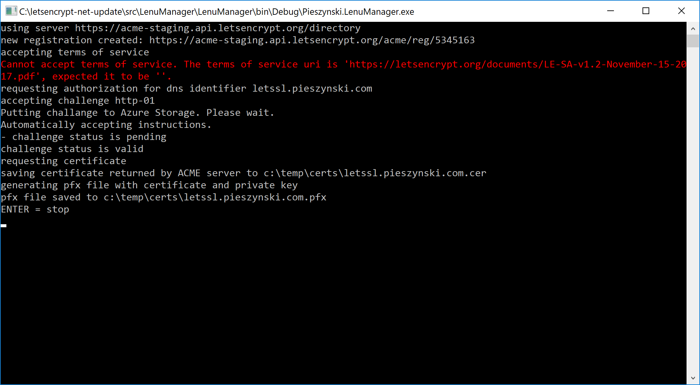

# LetsEncrypt DotNet Update
Biblioteka i aplikacja do tworzenia i aktualizacji certyfikatów w usłudze [Let's Encrypt](https://letsencrypt.org/).

Sposób użycia opisany w artykule [Certyfikaty SSL Let's Encrypt z pomocą Azure](http://pieszynski.com/temat/certyfikaty-ssl-lets-encrypt-z-pomoca-azure)

Najnowsza wersja: [Pieszynski.LenuManager.exe](dist/Pieszynski.LenuManager.exe) + [appsettings.json](dist/appsettings.json)



## Oocx.Acme
Repozytorium korzysta z delikatnie zmodyfikowanej wersji biblioteki [Oocx/acme.net](https://github.com/oocx/acme.net).

Wykonane zmiany to:
* `Pem.cs` klasa `Pem` teraz jest publiczna
* `AcmeProcess.cs` nie zapisuje do `Environment.CurrentDirectory` tylko do wskazanego katalogu
* `Options.cs` posiada dodatkowo poniższe pola:
    * ACME_CONNECTION_STRING
    * ACME_CONTAINER
    * StoreDirectory
    * IsTest

## Konfiguracja aplikacji
Poniżej znajduje się przykład konfiguracji zawartej w pliku `appsettings.json`.

```json
{
  "IsTest": false,
  "StoreDirectory": "c:\\temp\\certs",
  "Contact": "adres@email.com",
  "ACME_CONTAINER": "cert-container",
  "ACME_CONNECTION_STRING": "BlobEndpoint=https://.....blob.core.windows.net;Sha...si=wo-policy&...",
  "PfxPassword": "********",
  "Domains": [
    "letssl.pieszynski.com"
  ]
}
```

Gdyby Let's Encrypt nie chciał wygenerować certyfikatu bo nie jest podany link to umowy (TermsOfServiceUri) to wystarczy dodać do konfiguracji to pole w wartością określającą aktualny TOS, czyli np. `"TermsOfServiceUri": "https://letsencrypt.org/documents/LE-SA-v1.2-November-15-2017.pdf"` ale z tego co widzę to jest to aktualnie ignorowane.

Dodatkowo, gdyby Let's Encrypt zmienił namiary na swoje serwery to można podać samemu w zmiennej `AcmeServer`.